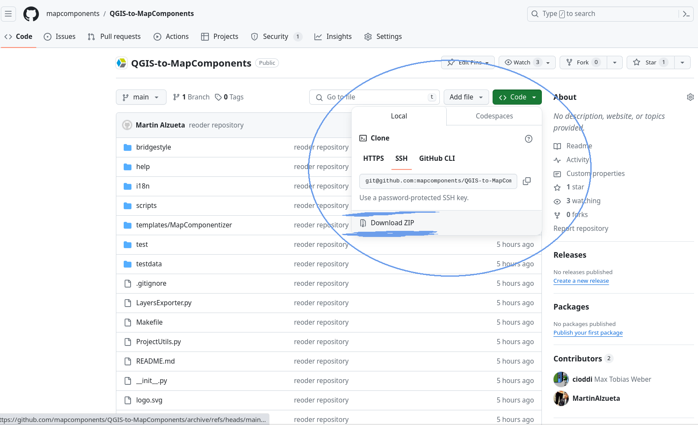
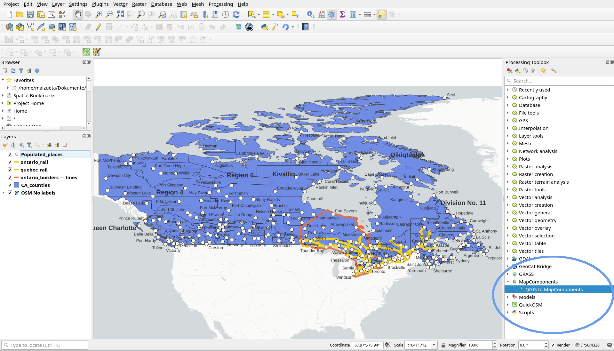
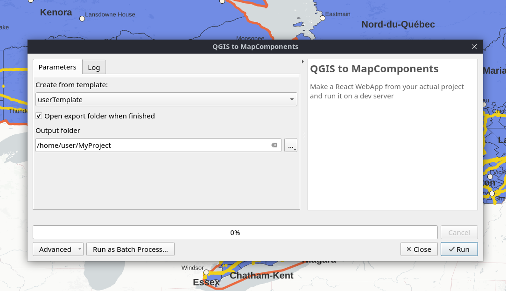

 


# MapComponentizer: a QGIS to MapComponents plugin 


 <!--  -->


MapComponentizer is a Python script that automates the process of exporting a QGIS project to a React-based web mapping application. The algorithm can be installed in QGIS as a Plugin, following the installation instructions in this document. 
The web application resulting from the export is based on the implementation of the [MapComponents](https://github.com/mapcomponents/react-map-components-maplibre) library, developed for the React implementation of the [MapLibre GL JS](https://maplibre.org/maplibre-gl-js/docs/) library. 

## Features
- Export .qgs and .qgz projects.
- Reproduce vector layers and WMS services in the web application.
- Export and display layer configurations of the original project individually (they will be saved as .json files in the public/exported folder in the destination web project).
- Make the web application available in a development environment at the end of the process.
- Retain the style of the layers from the QGIS project in the web application.
- Preserve project metadata (title, layer names) in the web version.
- Allow users to freely modify, extend, or simplify the created application by customizing the template used to generate the web application.

## Requirements
- QGIS
- Node.JS 

## Installation

1. Download this repository as ZIP file: 


2. Go to QGIS and open the "manage and Install Plugins" dialogue under the *plugins* menu. 

3. Select the "Install from ZIP" tab in the dialogue and look for the ZIP file that you downloaded. 

4. The plugin should be succesfully installed and the *MapComponents* group will now appear into the Processing Toolbox window in QGIS:




## Usage
1. Open QGIS.
2. Load the project you want to export.
3. Run the QGIS to MapComponents script from the QGIS Processing Toolbox (under Mapcomponents group). 


In the dialog you can choose the template to be used and the destination directory of the web application. In addition, you can select whether the program automatically opens this folder at the end of the process.  

4. Once the process is finished, the application can be started in a development environment by executing the following commands in the target folder: 

```
yarn
yarn run dev
```

5. The command `yarn build` prepares the application for its deployment. 


## Customizing your template
A default React template is installed in the _Templates/MapComponentizer_ folder in the root directory of the plugin. You can create your own template from scratch or by copying and modifying the default template. You can add new templates into the templates directory of the plugin, and the user dialog will automatically detect them and offer the possibility to choose which one to use for the export process.
## Contributing
Contributions are welcome! Please follow these steps to contribute:

1. Fork the repository.
2. Create a new branch (git checkout -b feature/your-feature).
3. Commit your changes (git commit -am 'Add your feature').
4. Push to the branch (git push origin feature/your-feature).
5. Create a new Pull Request.

## License
This project is licensed under the MIT License. See the [LICENSE](./LICENSE) file for details.

## Acknowledgements
Thanks to: 
 -the QGIS community for providing the [QGIS Python API](https://qgis.org/pyqgis/3.0/).
 -the developers of [MapComponents](https://github.com/mapcomponents/react-map-components-maplibre) for their React library.
 -to GeoCat for their [bridge-style](https://github.com/GeoCat/bridge-style) Libraray.  
 - to the MapLibre Community for their [MapLibre GL JS](https://maplibre.org/maplibre-gl-js/docs/) library. 